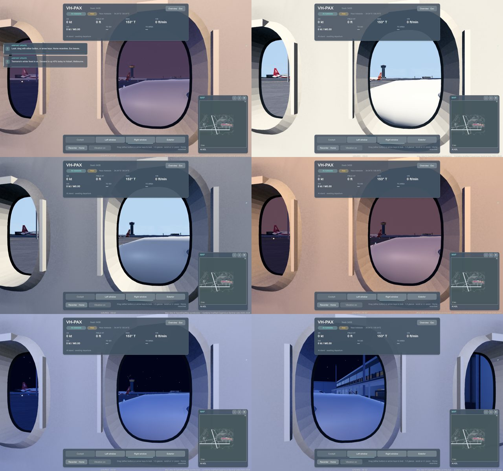

# Finding 2 — Saab right passenger window obstructions: not reproduced on clean main

9 October 2026, Claude (issue #725). Verdict: **not reproduced on clean current main.** No code or asset change; this
note records what was run, so nobody invents a fix without evidence.

## The original evidence

`evidence/saab-right-window-original.png` (vertically inverted raw capture) shows jagged black triangles around the
opening. Its footer stamp, once read the right way up, is `74d4311a · main · local changes`: a **dirty** build of
74d4311a (11:25, 9 Oct) with uncommitted edits, not a clean tree, and the report itself marks it as "earlier dirty-stamped
build — reproduce on clean current main". It was taken in the flight world at Kingscote (`Turnaround at destination`).

Since 74d4311a the cabin interior code (`PassengerCabinInterior*.cs`, `PassengerCabinProfile.cs`) is unchanged on main, and
the only change to the Saab glTF is the engine-intake refinement (#718). So any difference lives in the uncommitted edits of
that local build, not in committed source.

## What was run

Private Mac runner, current main plus the interior-audio fix (#728; before it, the passenger views threw every frame and the
scenario aborted), Saab 340B `VH-PAX` at its stand, `scripts/diagnose-game.py --remote`:

- Right window, visual clock 07:00 (dawn), 10:30, 17:00, 18:40 (dusk), 21:30 (night), then Left window at 21:30.
- All steps passed with no runtime errors; each 1280x800 frame inspected (contact sheet below, same camera as the player).

The window openings are clean: a thin black gasket around a smooth oval, with the cream moulded trim ring; no black
triangular geometry in the opening or in the adjacent window, in daylight, dusk or night.

## Limits (not covered)

- The Kingscote flight-world context (`AtDestination`, sea view, aircraft away from the Adelaide origin) cannot be set up
  with the diagnostic plan protocol, which only starts aircraft at a Mac-runner stand; the 600 s journey profile is not
  reachable from `diagnose-game.py`. If the artefact returns on a clean build at an outstation, capture it there with the
  journey profile (`scripts/agent-gameplay.py --profile full`) plus a Right-window view and open an issue with the
  clean-stamped frame; the cabin shell builder (`PassengerCabinInterior.Shell.cs`, `BuildFittedWindow`) is the first place
  to look (its comment already records an earlier "dark triangle at a cell corner" fix).
- One aircraft (VH-PAX), one stand, Clear weather.
