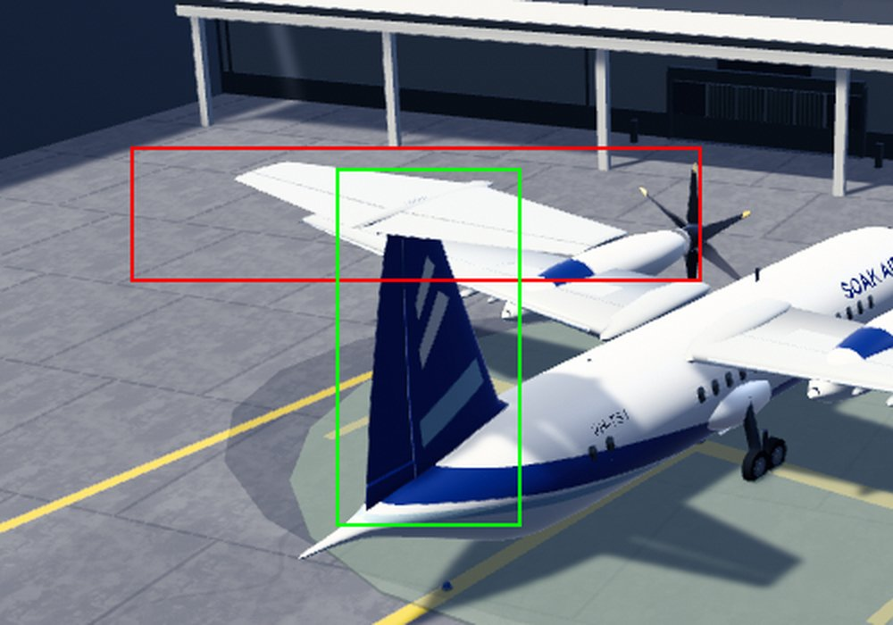

# Finding 15 — ATR 42 T-tail "missing": not a defect (misread frames)

9 October 2026, Claude (issue #726). Verdict: **not reproduced — the horizontal stabiliser is present and
rendered in the Exterior view.** No code or asset change; this note is the record.

## What was checked

1. Current main (c96780f3, after the ATR/Saab intake refinement), diagnostic runner (`scripts/diagnose-game.py --remote`),
   ATR 42 `VH-TS1` at its stand, follow camera and Exterior view, 1280x800 real frames inspected.
2. In the follow camera at four yaws/pitches (`tail-a`..`tail-d`) the T-tail is plainly visible above the fin.
3. A temporary, un-merged logging commit (branch `claude/atr42-ttail-diag-20261009`) listed the airframe's tail
   renderers and projected their world bounds to screen pixels with the live camera, in both views.

| Part (aircraft-local) | enabled | active | `isVisible` | in frustum | centre (m) | size (m) |
|---|---|---|---|---|---|---|
| Tail (fin) | yes | yes | yes | yes | 0, 4.28, -7.95 | 1.08 x 5.21 x 3.78 |
| Tailplane | yes | yes | yes | yes | 0, 6.77, -8.12 | 8.33 x 0.20 x 4.58 |
| Elevator L / R | yes | yes | yes | yes | ±2.02, 6.75, -9.01 | 4.00 x 0.24 x 1.96 |
| Tailplane saddle | yes | yes | yes | yes | 0, 6.77, -8.04 | 1.09 x 0.24 x 3.37 |

Same values in the follow camera and in Exterior (near 0.15, far 55000): nothing hides, culls or moves the tailplane in
the Exterior view.

## Why it looked missing

In the Exterior frame the camera sits behind, left and above the aircraft (about 15 m high, 34 m out), so the T-tail is seen
from above and behind. The tailplane projects to the screen box x 324–642, y 333–407 (red in the image); the fin's box is
x 438–542, y 344–545 (green). The white, panelled plate inside the red box *is* the horizontal stabiliser (elevator hinge
lines are visible on it), centred on the fin tip. Because the aircraft's own far wing, nacelle and propeller sit directly
behind it in that view, it reads as "a wing behind the fin" rather than a tailplane. The bundled evidence frames
(`evidence/models/ATR42/upright/exterior.png`, `ATR42-repeat/upright/angle-two.png` and `angle-three.png`) show the same
plate at the fin top: in `angle-two` it is the roughly 8 m wide surface across the top of the fin, against the roughly 24 m
wings with the propellers.

The packaged glTF also renders a T-tail in the offline audit
(`python3 scripts/audit-aircraft-geometry.py views <dir> ATR42`, `rear` and `top` views).

## Limits

- Evidence is one ATR 42 at one stand at midday; a different light or weather was not rerun (the bundled night/rain
  frames show the same plate).
- A thin stabiliser seen edge-on or against the far wing remains easy to misread; nothing was changed to make it
  more conspicuous.
