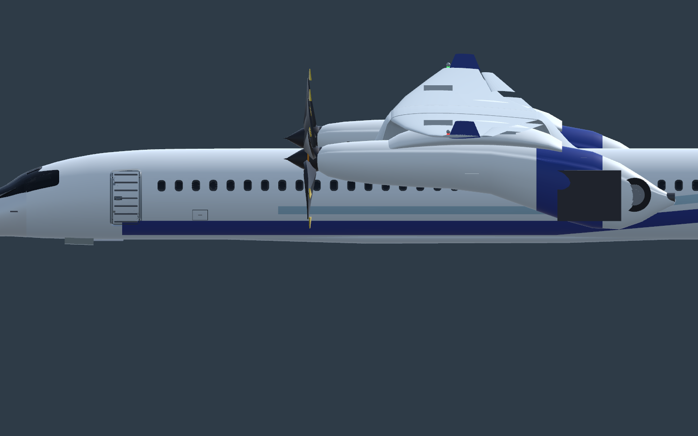
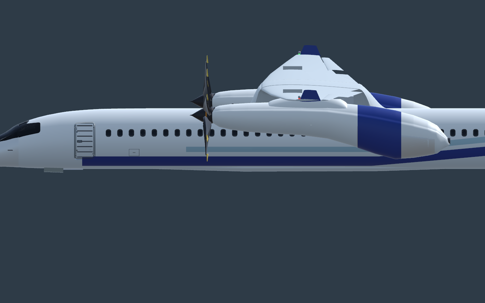
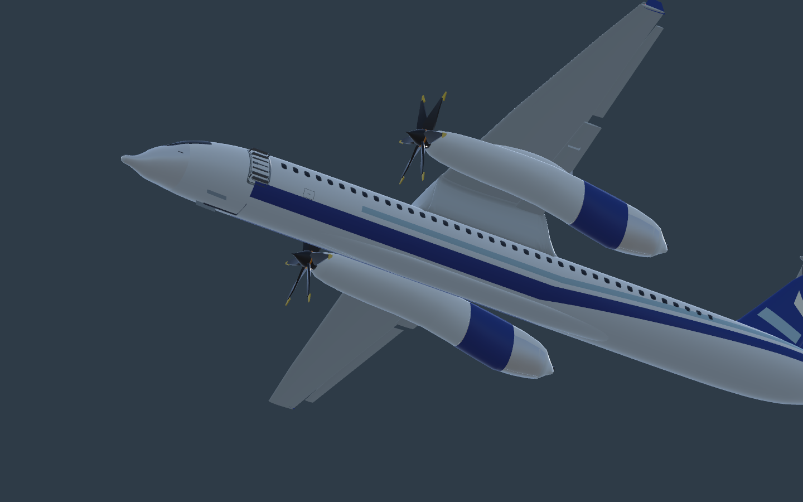
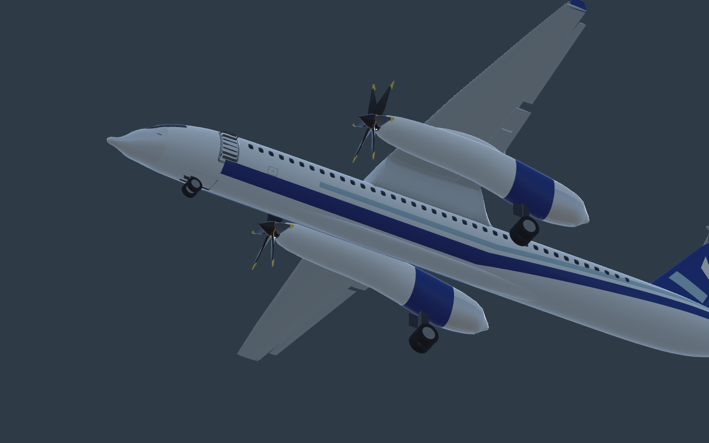
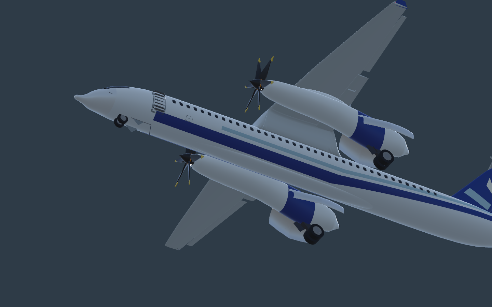
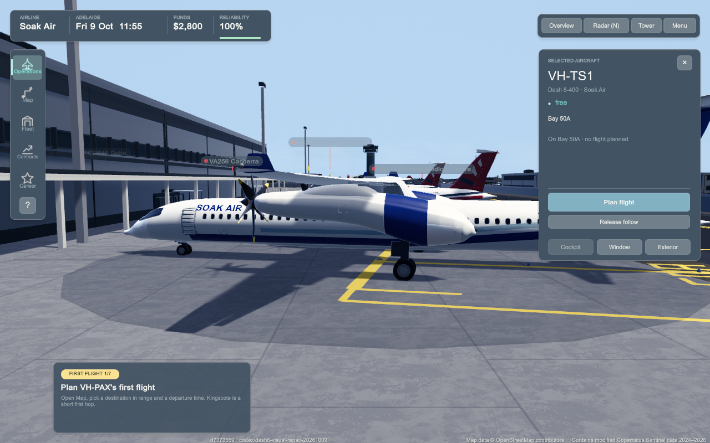

# Dash 8 visual repair — task #712

Symptom: the supplied airborne side-follow screenshots show a large rectangular gear panel and exposed main tyre behind each nacelle, plus a raised nacelle/wing join.
Expected: folded main gear enclosed by the nacelle; fitted bay doors close after the cycle; nacelle joins meet the underside of the wing.

## Reproduction and cause

Baseline: `74d4311a79091a3814e893513461008465bc6ca4`, pushed before native execution. Actual Unity runtime-builder gear-up side/under frames reproduce both protruding doors and tyres. Logs show all four tall main doors parented to `Gear L/R`. The generic classifier correctly recognises the authored thin vertical plates as leg-mounted doors, but those are the wrong geometry for this nacelle bay. The rear nacelle also fails to enclose the folded twin wheels. Its separate oval wing fillet exposes a raised shoulder/cap.

Baseline packaged Mac diagnostic `diag-a5881a7bf4ac40f2`: five follow/side/front/opposite/overview steps completed, matching clean build and private save, zero runtime errors. The baseline capture helper flipped PNGs vertically; the independently merged capture correction is included in the repair base. The baseline native editor frames are upright. Earlier remote request `diag-af32b4e8ad55423f` was cancelled by runner concurrency before execution; no remote result is claimed.

## Repair

AIR-006 only: curved closed bay leaves, independently hinged on opposite nacelle shoulders; expanded rear nacelle enclosing the actual existing aft-fold wheel envelope; smooth shared-vertex shell and under-wing fillets with buried shoulders; cowl paint refitted to the changed shell. Surgical `--nacelles-only` mode retains the finished fuselage, cockpit, cabin doors, wings, tail, generic fictional paint and all other parts. Runtime glTF/bin, editable FBX, thumbnail and packaged mirrors retain their paths/GUIDs. Simulation, identity, save format and phase timing are unchanged.

The generic tail marks intentionally remain the game's fictional paint. No copied Qantas artwork is introduced. Side-on rotating propellers may appear thin because their disc is viewed edge-on; a still does not establish an animation defect.

## Verification

- AIR-006 bounds, bay geometry, panel shape and full folded leg/tyre/rim/scissors enclosure pass (maximum radial envelope below 0.95).
- Nacelle and wing fillet indexed edges each have two incident triangles; positive volumes.
- Native Unity runtime-builder: nine repaired side/front/under PNGs across gear-up, gear-down and half-cycle poses. Inspected gear-up side/front/under plus gear-down and mid-cycle under frames: no exposed tyre/slab at gear-up; deployed legs/tyres remain visible; independent bay leaves open mid-cycle. Rig logs confirm the four main bay leaves are no longer leg children.
- Native existing `AircraftArticulationRigTests`: 9/9 pass. Focused headless `AircraftArticulation`: 44/44 pass. Initial sandboxed NuGet restore failed; rerun with normal network access passed.
- Fixed packaged Mac build `d73735591a4f596523fbbd970c5f8b3567249e3a`; identical five-step scenario `diag-3246ee24a4a842f2`: 5/5 completed, correct DH8D subject/private save, zero runtime errors. Actual upright player side/opposite/follow frames inspected: closed white nacelle doors, deployed wheels and fitted joins visible. Front ground-camera probe is inside the nearby terminal and is obscured: that PNG is not a front-view visual pass; native front frame provides unobstructed evidence.
- All 185 other finished model nodes are exactly preserved; only the twelve declared nacelle/door/fairing/cowl nodes change. AIR-006 packaged model/bin/thumbnail mirrors match.
- Focused DH8D floating-part audit passes. Whole asset audit retains the existing satellite JPEG mirror mismatch and detects generated ignored macOS notification bundle internals without metadata after the build; neither is an AIR-006 mismatch.

No actual airborne journey, moving-propeller video, storm/night matrix or frame-time certification is claimed. Gear-up/mid-cycle evidence uses the real runtime rig driven in native Unity review; packaged captures are parked gear-down.

No broad test suite, long soak or performance certification.

## Frames

| Before gear-up | After gear-up |
|---|---|
|  |  |

