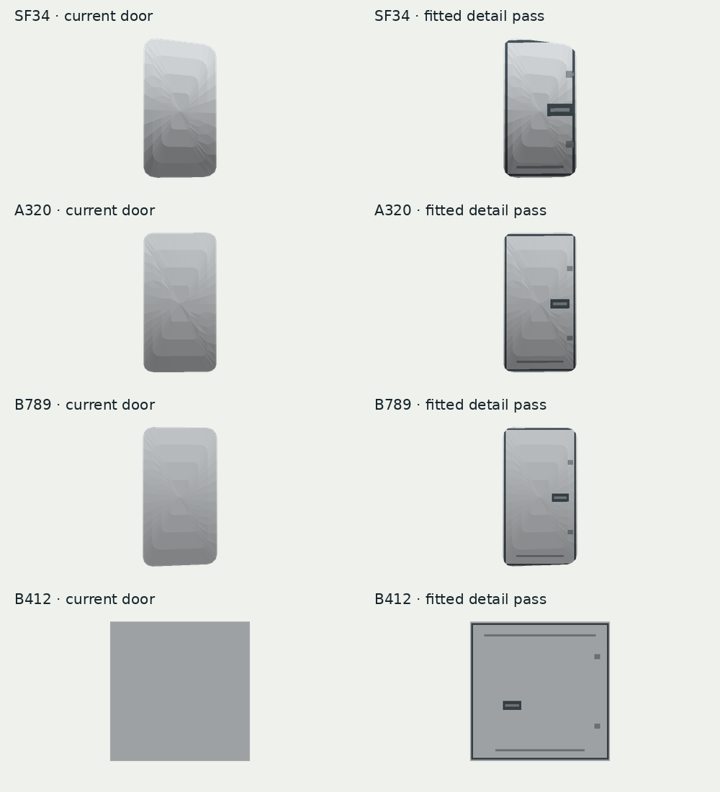

# Fleet livery surface details — 7 October 2026

Task #578. Bailey requested a plan, implementation and merge, with light testing.
The implementation plan is in [PLAN.md](PLAN.md).

All existing fictional colourways, titles, registrations and silhouettes remain.
The runtime finish now adds thin door seams, dark handle surrounds, metal latch bars,
thresholds and hinge marks. Cargo leaves get lower paired latches; Bell sliding
leaves get an upper rail. Forward service-hatch outlines sit below the window belt.
This is original project geometry generated from the existing assets, with no new
external source, paid generation, texture or model replacement.

The shared entry point handles both glTF and imported prefab aircraft. Geometry is
clipped against outward-facing triangles, in aircraft coordinates, then stored in
the source panel's own coordinates and parented to it before rig construction.
The existing hinge rebake includes these children. Generated mesh owners retire
old detail meshes on rebake and release the final mesh when a view is destroyed.
Two shared material groups per detailed panel; no per-frame rebuild or colliders.
Unreadable/absent source meshes retain their current appearance.

## Coverage

An offline C# probe called the production geometry builder against the actual
committed glTF/bin assets, asserting nonempty trim and hardware on every door and
fuselage. Counts include both service hatches. It does not exercise Unity loading.

| Type | Door leaves detailed | Added triangles |
|---|---:|---:|
| ATR42 | 2 | 596 |
| SF34 | 2 | 521 |
| DH8D | 2 | 602 |
| E190 | 3 | 829 |
| A223 | 3 | 855 |
| A320 | 3 | 898 |
| B738 | 3 | 850 |
| B38M | 3 | 852 |
| A21N | 3 | 837 |
| A359 | 8 | 1946 |
| A339 | 8 | 2056 |
| B789 | 8 | 2056 |
| B78X | 8 | 1938 |
| B412 | 2 | 104 |

## Visual evidence

This is an **offline geometry proof**, rendered from production C# geometry and
shipped door meshes with the repository's z-buffer rasteriser. It isolates leaves;
existing separate frames/handles, aircraft paint, lighting and runtime articulation
are not shown. The faceted shading is the offline rasteriser, not a Unity result.

## Validation

- Production geometry probe: all 14 types, 58 door leaves and 14 fuselages generated trim and hardware.
- Asset metadata audit: 1,805 unique GUIDs and 388 byte-identical runtime art mirrors passed.
- Five focused clipping checks passed: left/right curved surfaces, back-face exclusion,
  patch bounds, inward-wound Bell panels, empty intersections and invalid indices.
- Headless Unity-NUnit compile check passed. The initial full run encountered the existing
  `BusyDay_NoAircraftDriveThroughEachOther` failure on main (fixed separately in #579).
  Final headless/CI results are recorded in the PR.

## Native follow-up (unverified in Unity)

Check overview and close follow at day/dusk/night; open/close cabin and cargo doors,
including the relocated ATR airstair; inspect all widebody door panels and Bell rails.
Check detail LOD transitions, prefab imports with readable meshes and view removal.
Confirm seam contrast on pale/dark custom liveries and freighter conversions, and
profile spawning multiple widebodies. No native compilation or performance claim.
