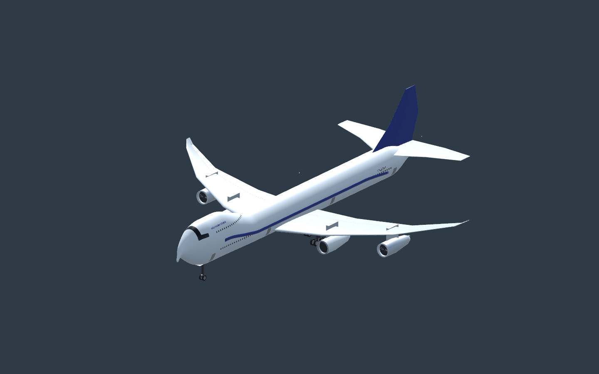
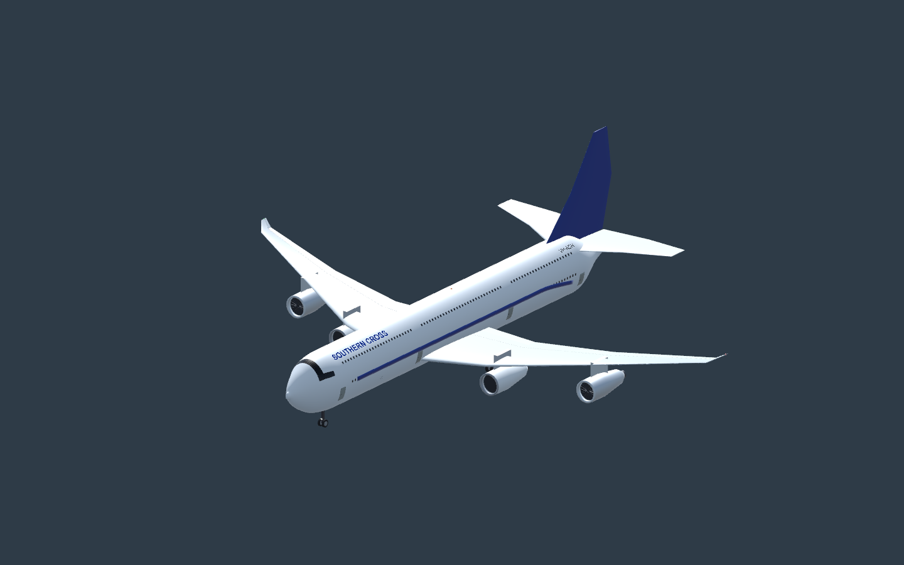
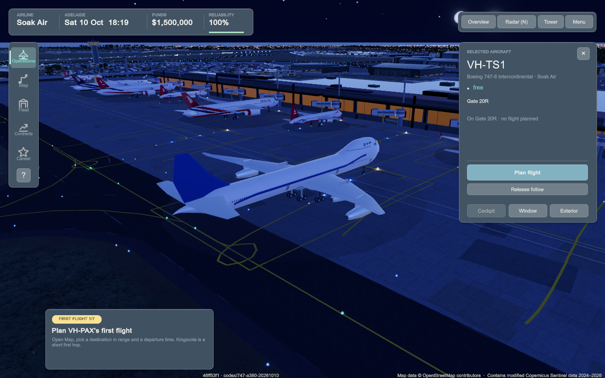
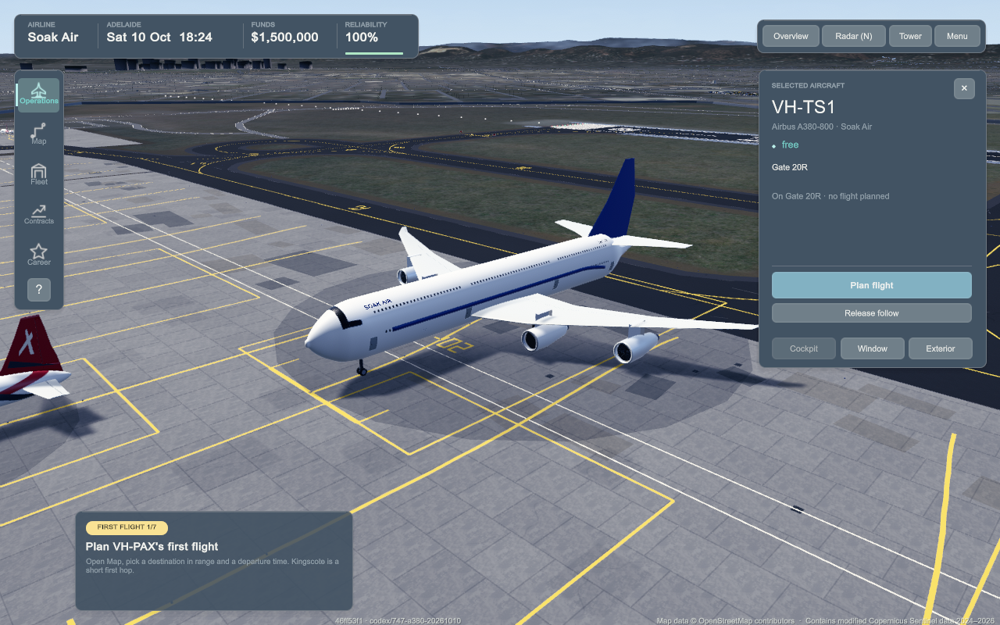

# Passenger 747-8 and A380-800 support (#778 / PR #781)

Finished 11 October 2026. Bailey selected the passenger 747-8 Intercontinental. B748 and A388 are buyable at International progression, use shared real-dollar lease/cost inputs, code F stands and reserved return capacity, and have distinct original four-engine models, running gear, service layouts and audio profiles. Existing fleet assets, ambient timetable and save schema are preserved; economy v24 comes from the previously merged economy task.

## Runtime evidence

| Aircraft | Clean tested source | Feature/save checks | Selected 40× ADL–KGC round trip |
|---|---|---|---|
| B748 | 46ff53f1 | 9 passed, 27.17 s | Passed, 237.97 s |
| A388 | 46ff53f1 | 9 passed, 25.41 s | Passed, 265.66 s |

Both traces observed actual engine start, taxi/departure, outbound flight, destination turnaround, inbound/landing, return taxi, trip count 1 and completed overview with origin 0,0 / Adelaide visible. No runtime exceptions or agent failures in the final logs. Day/rear/dusk/night follow frames and relevant journey cockpit/landing/completed frames were opened and inspected. The feature save action writes, reads and restores the private disk save; personal saves are untouched.

The native checks caught an A380 arrival waiting indefinitely after background B738 traffic took its overflow departure stand. Player code F aircraft now retain the departure line/pier and adjacent clearance through their rotation, derived from existing persisted state and DepartureStand. Owner-aware queries exclude the returning aircraft from its own reservation. Shared compatible F overflow remains available when leased 18R is held.

Final title-only source **80c5d09c** builds successfully for **arm64/x86_64**, clean stamp. Actual Unity runtime-builder front/side/rear frames for both types were inspected using AircraftAppearanceReview; the A380 wordmark clears its upper windows and the 747 registration sits on the aft main-deck skin. No aircraft geometry, flight or reservation behaviour changed after the complete 46ff53f1 journeys. The final build's new labels were checked with the native builder; unchanged journeys were not repeated.

## Focused checks

- **63/63** final headless service/layout/cockpit/stand/reservation checks pass. Fuel workers and setup/clear trips stay outside every nacelle; four-engine fuel anchors use the outer engine. Twin-engine anchors are unchanged.
- **10/10** title checks and generated **15** title/jet-door tables pass. A380's double-deck crown uses its measured ellipse and a type-specific tilt bound; other aircraft title fits are unchanged.
- **11/11** final native purchase/save/overflow/return-reservation checks pass. Both typed identities and their return reservations survive save restoration without self-blocking.
- Earlier **86/86** native checks cover actual four-fan/five-strut/four-truck builders, 18/22 wheels, gear cache/pause/cycles, model bounds, catalogue assets and taxi wheelbases; **84/84** integrated-economy headless checks passed. These are separate overlapping selections, not a combined suite total.
- **12/12** private gameplay-runner regressions pass. Full journeys now honor their selected aircraft type and inject a compatible base through public save restoration; engine-start camera eligibility remains normal.
- Generator byte check passes for both glTF/bin/FBX payloads; connectivity passes within 5 cm. Metadata/mirror audit passes: **2,168 GUIDs / 453 mirrors**. Python syntax and Unity NUnit 3.5 compile checks pass.

## CI and limits

Main at 24297c1e already fails land-cover colour, Emirates/Qatar evening scheduling, drawn-final spacing, busy-day ground separation and night-sky review cases. PR CI on 46ff53f1 passed 2,168 tests and failed eight such existing cases plus the new A380 title-band assertion. The title fit/assertion is corrected and all ten focused title checks pass. Final source 80c5d09c CI passes 2,169 tests and fails only the eight confirmed existing cases (run 38059560534, job 114234862859). No test suppression or protection bypass is used.

This is original stylised aircraft support: cockpit display families are representative shared Boeing/Airbus layouts and passenger views cover the main deck. Exact variant instrumentation, upper-deck traversal, exhaustive packaged listening, long-haul destination ground compatibility, real dispatch approval and performance are unverified. The regional journey checks use the existing game's airport/flight abstractions, not certification of either aircraft for real Kingscote. Historical AAL code F stand references and authored operating/cost assumptions are distinguished in AIRCRAFT_SPECIFICATIONS.md.

Intermediate failures (cold cockpit eligibility, interrupted B748 journey, outer-pylon/root-light connectivity, direct internal-setter compilation, fuel-worker crossing and stolen return stand) are retained in local work logs and excluded from final passes. Full suites and performance/long soaks were not run locally.

## Saved evidence

Reports/results and representative unchanged native PNGs: [four-engine-fleet-2026-10-10](four-engine-fleet-2026-10-10/).

