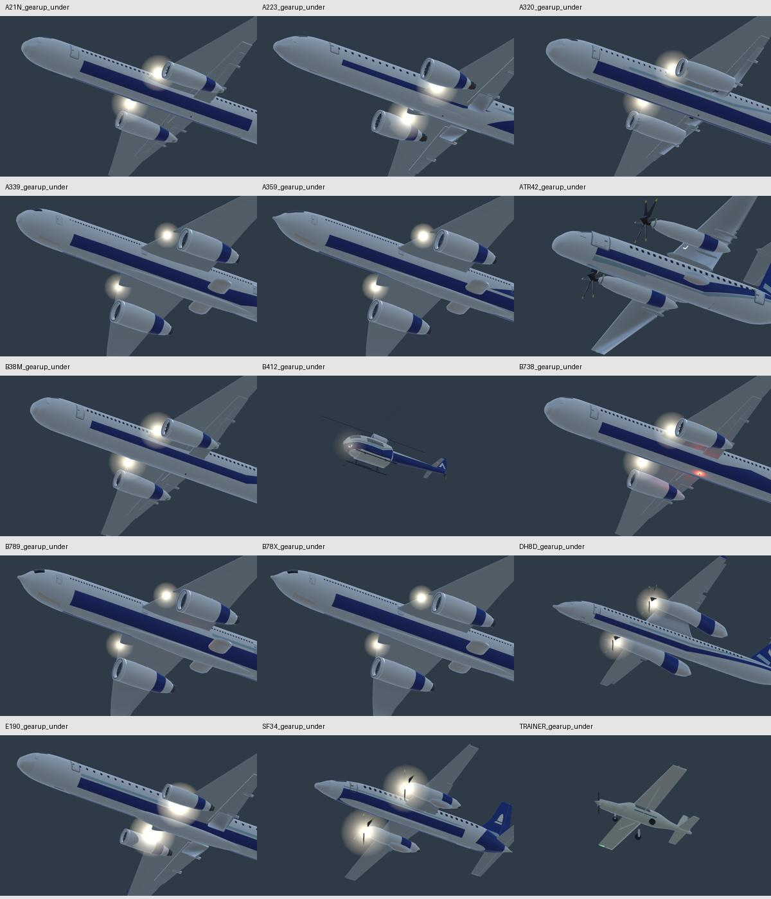
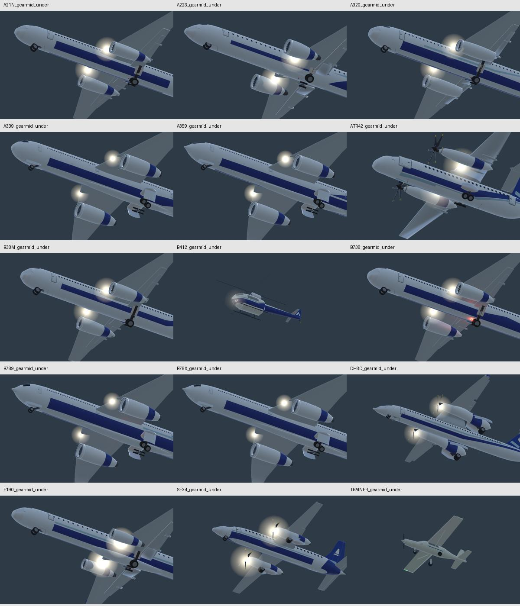
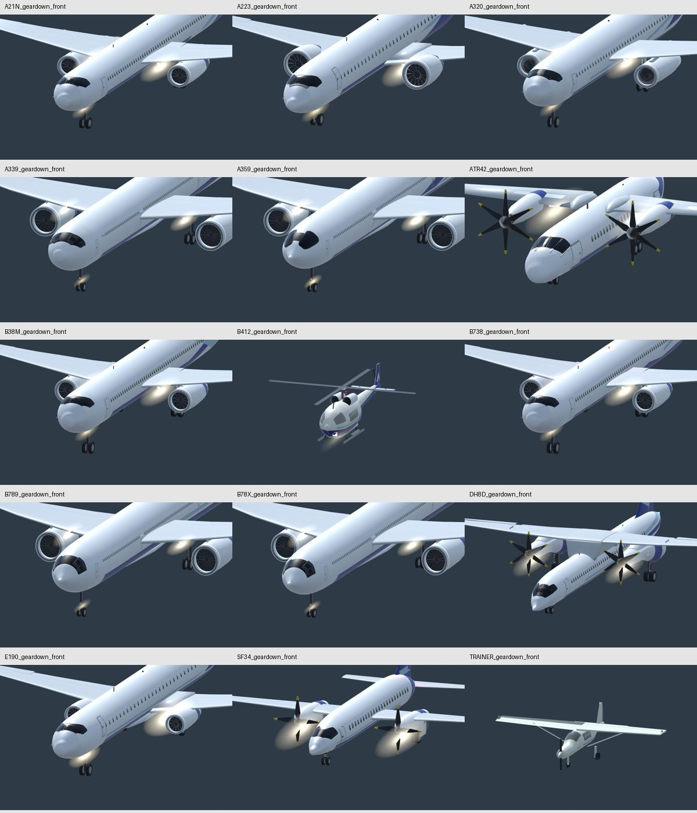
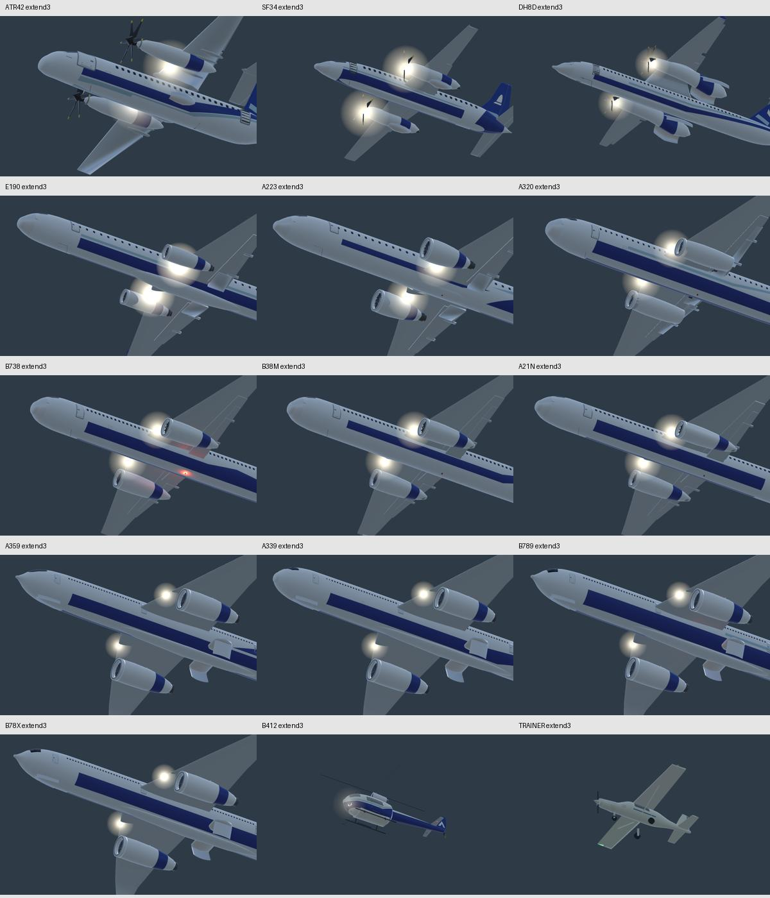
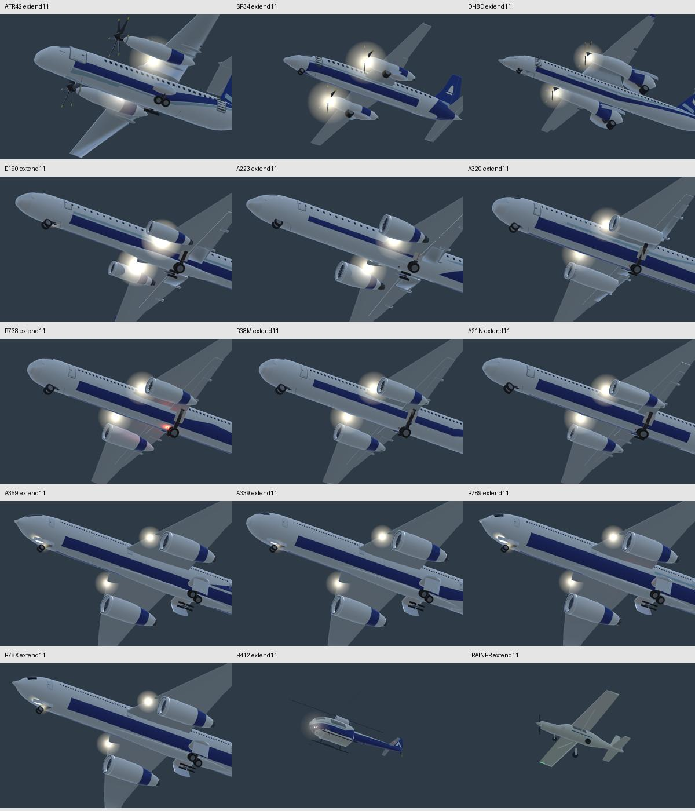
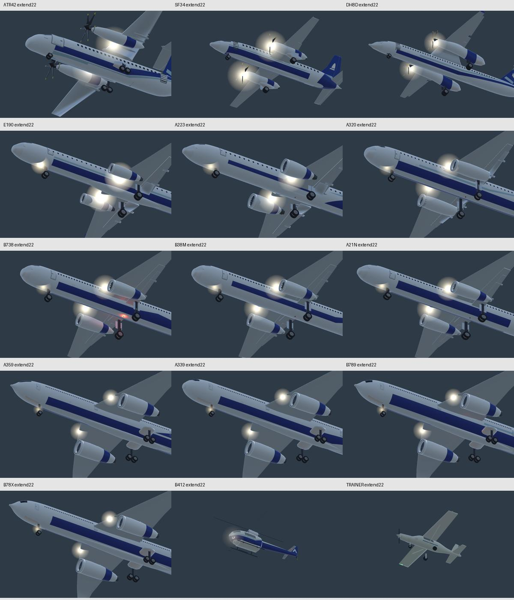
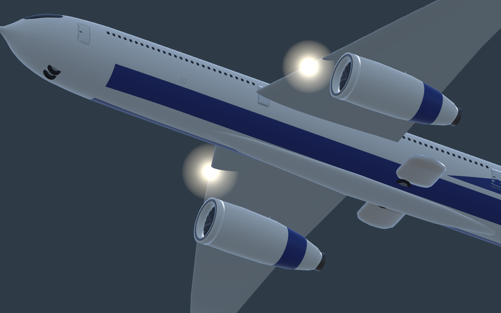
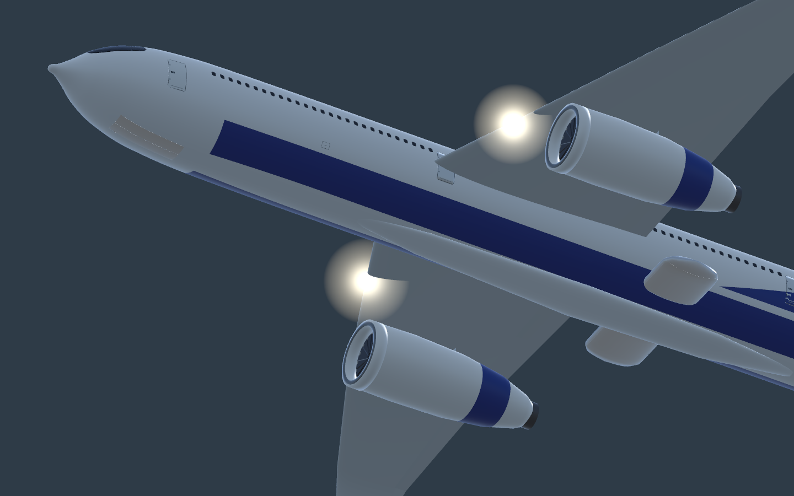
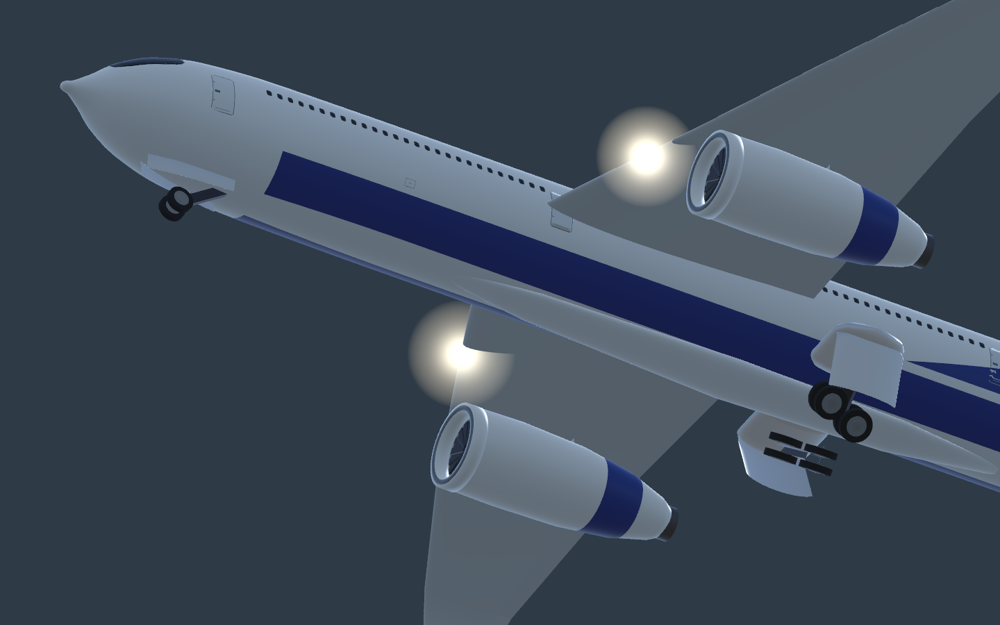

# Fleet landing gear — #757

Outcome: improve fleet gear mounting, deployment/retraction, doors and associated motion. All 13 passenger types are in scope; the trainer retains fixed tricycle gear and Bell 412 retains fixed skids.

Baseline `6cd232bd`: native runtime-builder folded frames show exposed widebody nose/main tyres. Source trace establishes an off-centre top pivot for canted struts, overlapping door/leg timing, independently reseeded part clocks after reclassification, and widebody bogie beams/axles left in the strut while their wheels tilt. Widebody kits lack animated bay leaves.

Implementation: top-vertex fitted mounting pivot; single per-root gear timeline retained across cache rebuilds; door fully open before/through leg travel; steering centres before folding; simplified kit stow angles fit above horizontal; actual beam/axle triangles follow the truck; missing widebody bay leaves are clipped to existing underside skin. Existing authored doors and Dash 8 nacelle repair retained. Gear-down wheel positions, ground datums, simulation, paths and saves unchanged.

## Verification

- Headless articulation: **47/47 pass**, after integration.
- Focused native articulation, real-builder geometry/cache/pause and parked motion: **75/75 pass** on `c31b26fc` (same gear source as the later roadmap-only rebase). Saved result: `native-tests.xml`.
- Native actual runtime builder: **15 active airframes × up/down/mid × side/front/under = 135 final frames**, on `c31b26fc`. Inspected fleet underside up/mid, fleet side up and front down sheets plus full-size A350/Dash 8/ATR probes. Widebody up tyres are enclosed, independent leaves open during transit, bogie beams carry their axles, deployed gear remains visible. Trainer wheels and Bell skids remain fixed.
- Extension driven at 20 fps: gear-up → approach down for 3/11/22 seconds. All-fleet sheets inspected; the widebody sources are the final welded-shell pass `49db8b11`, remaining types the unchanged gear pass `31fbeb17`. Doors open before leg movement, half-extension shows the legs emerging, and down locks precede closure. Additional 10/90% retraction frames retained locally.
- Native tests caught a 144-degree Dash 8 hinge reversal on reclassification; the cached rest hinge sign fixes it. Alternate widebody builders initially skipped the new leaves; shared pivot setup fixes them. Visual review caught cancelling two-sided normals and per-triangle shell seams; welded closed leaves fix the finish. These failed intermediate revisions are not claimed as passes.
- Unity metadata/mirror audit passes: 2,130 unique GUIDs, 447 runtime mirrors, 70 committed character materials.
- Packaged flight/journey check pending. No full suite, long soak or performance certification.

The generated leaves fit existing solid kit skins; this does not rebuild detailed wheel-well interiors, hydraulic lines or type-certified mechanisms. Fitted fold angles are stylised kit values. Gear-down contact positions are preserved, rather than changing taxi routes or simulation wheelbases.

## Actual native frames

| A350 before | A350 after |
|---|---|
|  |  |

Reference: [ATSB Saab 340 gear investigation](https://www.atsb.gov.au/sites/default/files/investigation-reports/ao-2014-189-final.pdf) confirms nose/main forward retraction. Stow angles/cycle values here fit the simplified kits; they are not manufacturer maintenance procedures.
