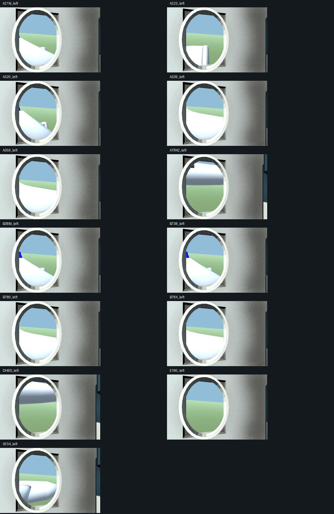
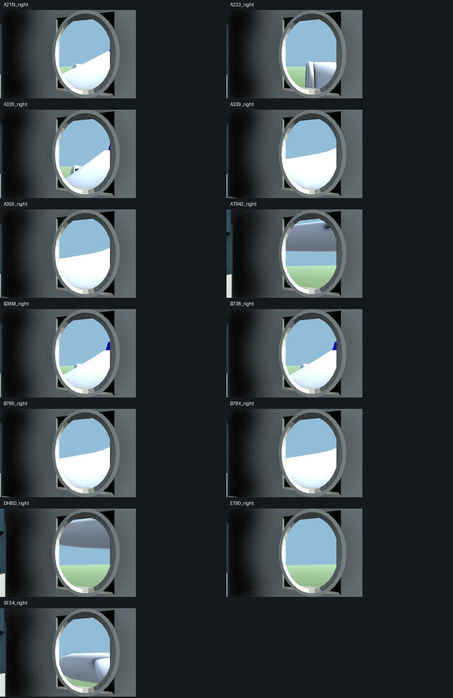
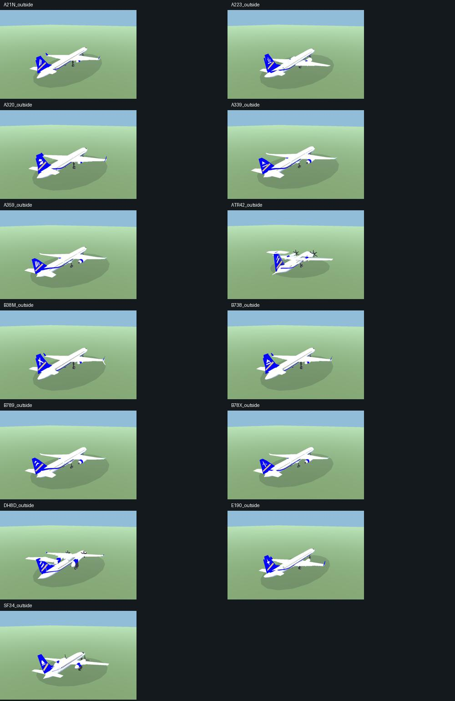

# Passenger/exterior flight views — 1 October 2026

Scope: all 13 passenger aircraft; fitted left/right window seats, cockpit switching
and an exterior aircraft orbit through regional journeys. Representative economy
layouts, not operator-certified cabin replicas. SF34/ATR42/DH8D are separate fits;
ten jets use their own exterior window stations. Freighter refits exclude cabin view.

Focused headless selection/availability/world checks: 35/35 passed. Native final
world/flight-view/camera checks are retained in `native-tests.xml`. Includes both
window sightlines for every type using real generated meshes; renderer restoration
on destruction; at most six cabin material batches; camera switching/optics and
origin changes; distant terrain remains active for all four flight-view modes.

Native render review: 52 stills (left/right/cabin/outside × 13 types), rendered
with actual runtime kits in Unity. Contact sheets retained below. Checked both
side windows and full exterior restoration/framing. Plane/ground scene is a review
fixture, separate from packaged gameplay. Full-size originals remain in ignored
`work/passenger-review/` in the task checkout. Six material batches per selected
cabin, with no per-frame geometry creation. Left/right switches reuse the cabin.

Player acceptance: build and short regional view cycle pending. Existing South
Australia coverage and recorded long-flight stall are not resolved by this feature.
No new FPS or full-flight completion claim.

Review commands: native `PassengerAppearanceReview.Run` with
`-passengerReviewOutput <absolute path>`. Packaged fresh soak:
`-airsideReviewCockpit -airsideReviewFlightView LeftWindow
-airsideReviewJourney KGC -airsideReviewJourneyRate 100
-airsideReviewViewCycle -airsideReviewViewOutput <absolute path>`.
The cycle waits for a distant origin, captures left/right/outside/cockpit at six
second intervals, then returns to overview and quits after its fifth PNG. It
fails on an unsuccessful mode switch. Accelerated review is not live-time pacing.
