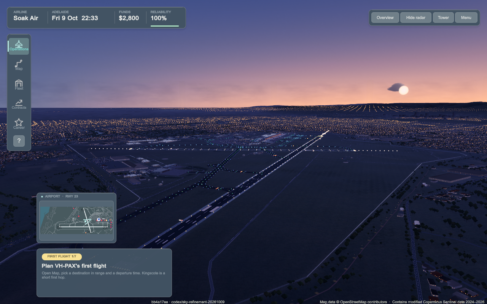
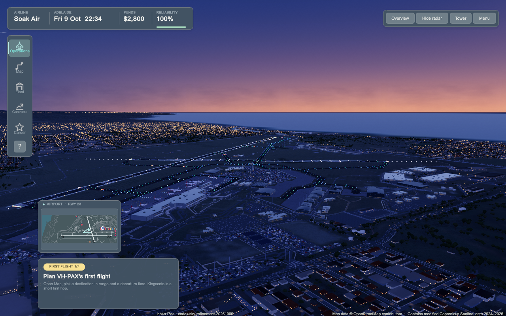
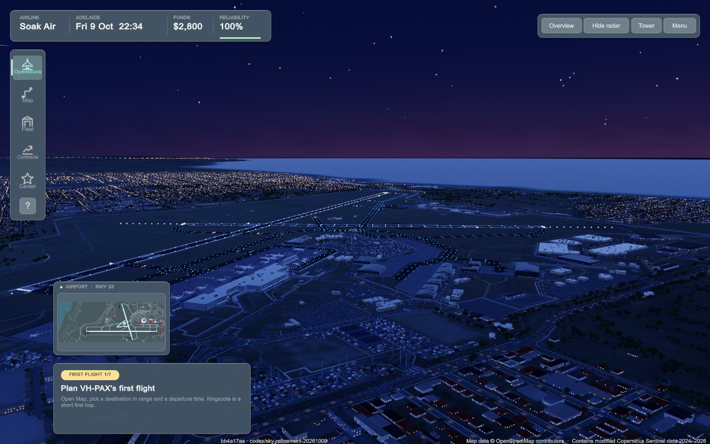
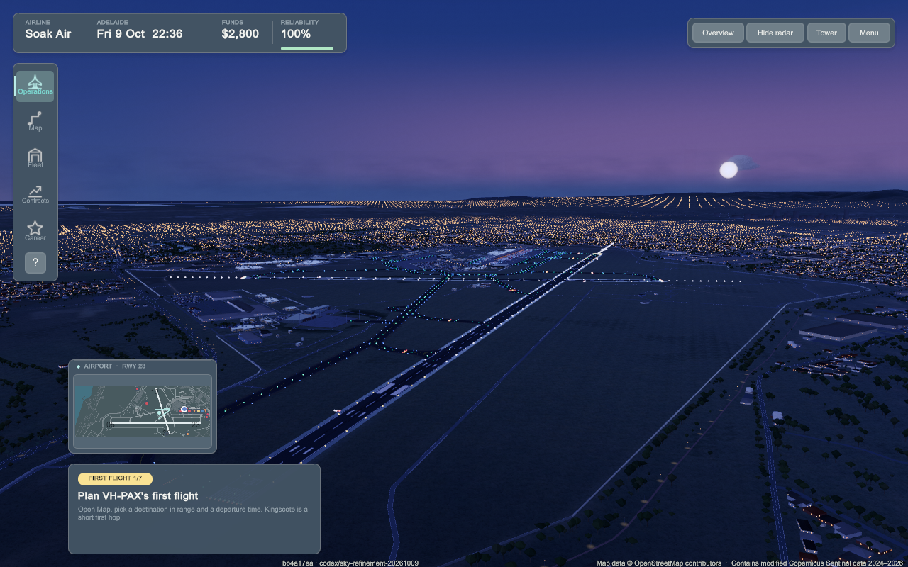

# Sunrise, sunset and evening sky — 9 October 2026

Tasks #758 / #773. Extend the existing original analytic sky, celestial clock and observer weather.

Baseline 8aa14b6e's 19-step native report and all dawn/day/sunset/evening/night,
weather and follow frames inspected. Warm colour extended high and blue hour read
purple. Narrow the amber vertical falloff (8 to 14), reduce the broad aureole,
soften dawn to peach, cool blue hour and add a restrained opposing rose band above
the cool horizon. No external asset, cost, simulation/save/camera change.

## Native verification

Rendered source **bb4a17ea**, pushed clean before execution. Universal x86_64/arm64
Mac build: `Build Finished, Result: Success.` Shader imported/compiled successfully;
the existing build script recovered one Bee graph stall. Clean stamped identity retained here.

- Identical 19-step cycle scenario passed, zero runtime errors; dawn 06:35,
  sunrise 07:00, noon, sunset 19:15, twilight 19:40, blue hour 20:00, night 22:00,
  overcast/fog and parked-aircraft follow day/dusk/night frames inspected.
- Additional 12-step opposite-horizon/tower scenario passed, zero runtime errors;
  07:00 opposite horizon and 19:15 opposing rose band inspected; settled tower
  clear/overcast/fog show suppression of the clear-sky band at lower observer height.
- Day remains pale blue; warm sunset concentrates low, overhead stays cool; stars
  emerge at twilight and are retained at night. Existing airport/night ground lighting
  is unchanged. City lights differ from baseline because main's #760 is included.
- HUD time is the running simulation clock; the review `time` action overrides visual
  celestial time only. Moon placement remains simulation-clock-driven and was not changed.
- All relevant real PNGs opened; retained representative images, reports and plans here.
  No broad suite, flight journey or soak. Diff whitespace check passes.

Final branch rebased onto #757 gear main after these runs. Both sky source files are
byte-identical to bb4a17ea; the combined gear/sky revision was not rebuilt or replayed.
The local verified app remains `work/builds/Airside.app` in the sky checkout with its
honest bb4a17ea stamp. Personal running game/settings/save and canonical generated
pipeline/package edits preserved.

GPU timings, all seasons, all flight altitudes, normal-speed subjective transitions,
weather-layer disabled settings and sun/moon accuracy are not established. Sky colours
and the opposing band are artistic approximations, not physical atmosphere scattering.

