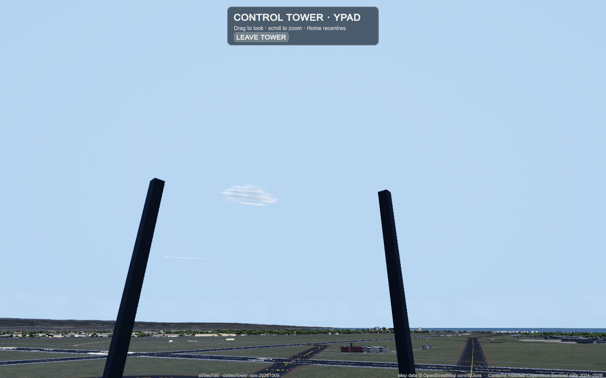
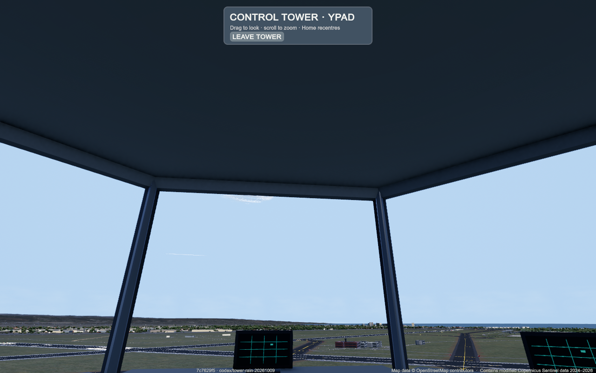
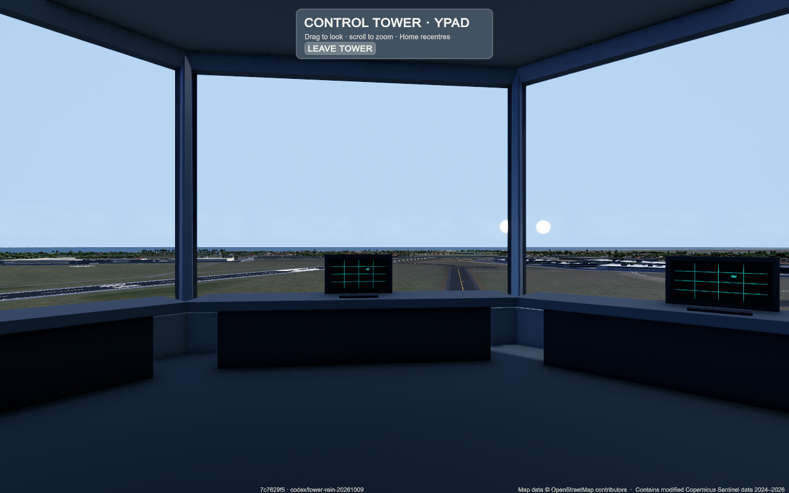
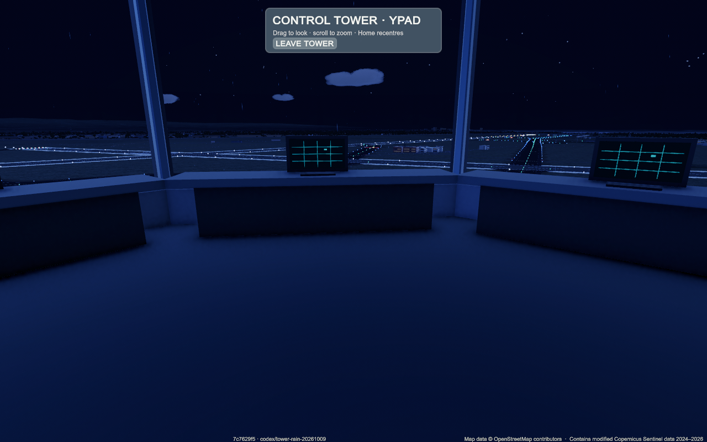

# Tower cab / rain motion — task #756

Reported: tower view feels like being on the roof; rain drops look slow in flight.
Expected: an enclosed controller cab with clear airfield sight lines and rain streaming
past at the aircraft-relative speed.

## Baseline

Pushed diagnostic revision a05ec7d0. Private Mac runner was offline; request
37903724832 was cancelled. An isolated local checkout with cloned Unity cache built
successfully and completed all 17 scenario steps, zero runtime errors. Personal
running game/save untouched. Local evidence:
`work/issue-diagnostics/diag-6706a62891e94cc8/runs/20261009-184739-803687a2/`.
Inspected tower-up/down/side: no ceiling underside, no console, detached-looking posts.
First tower capture is still in the entry blend; subsequent fixed-eye captures are
valid comparisons. Rain fast probe injected an explicitly synthetic 220 m/s observer
velocity; report reads 89.998 m/s, confirming the low cap. This is not a flown journey.

## Cause / fix

Exterior roof prism faces up only and there was no cab interior. Add original inward
ceiling, carpet, knee/sill/fascia/post structure and low consoles on the existing cab
footprint. Keep unobstructed windows and existing eye/camera controls.

Rain was capped at 90 m/s, motion discarded frame time beyond 0.1 seconds and streaks
were capped at three times a radius-derived base. Preserve normal fleet speed, full
elapsed time, fixed exposure length and absolute-world motion across origin shifts.

## Verification

Fixed pushed revision **7c7629f5**, clean universal macOS build: `Build Finished,
Result: Success.` Build and same 17-step scenario passed. Native before/after
ceiling, side/rear/down interior, night cab, slow/fast rain, exit and overview frames
inspected. Zero runtime errors in both reports. Fixed synthetic 220 m/s observer
reaches **216.697 m/s** while easing toward its target (baseline **89.998 m/s**).
This validates the mesh/speed correction in a controlled probe, not an actual flown
jet/cloud crossing or normal-speed subjective animation review. Initial entry
captures include the camera blend; the subsequent steady cab frames are used.

Local fixed evidence: `work/issue-diagnostics/diag-7e74489605474afe/runs/20261009-185219-c8cbdb0d/`.
Retained scenario, reports and representative PNGs are beside this document.

Four existing ControlTowerViewTests pass with the installed `.dotnet/dotnet` runtime;
initial PATH-only quick attempt failed, then the existing runtime was found.
12 agent-gameplay and five diagnose-game regressions pass. Python syntax and
`git diff --check` pass; generated presentation map/ADR index refreshed.
No full suites, full journeys, performance pass or personal-save tests.
The branch was rebased onto the subsequent #759 low-severity fixes; tower/rain sources
are unchanged from the tested revision. That combined revision was not rebuilt or
replayed; the saved native build retains the tested 7c7629f5 identity.

Frame timings are affected by local concurrent work/capture overhead and do not
establish performance. Scroll/drag/Home hit-testing was not driven by this runner;
existing camera control code remains unchanged.

